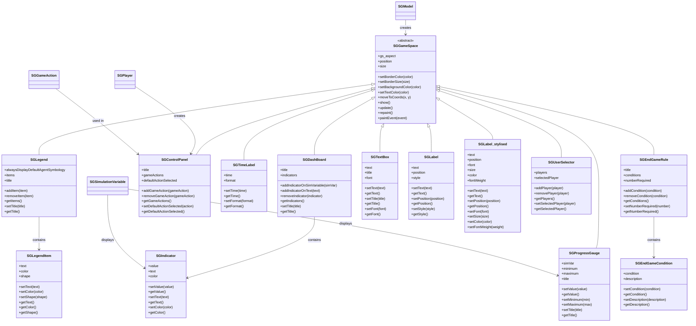

# SGE GameSpaces - Detailed Classes Diagram

This diagram provides a detailed view of the GameSpaces system in SGE, showing all UI components that can be displayed in the simulation interface.

## Overview

GameSpaces are UI components that provide different types of information display and interaction capabilities in SGE games.



## GameSpace Types

### Information Display
- **SGLegend**: Shows symbology and color coding for entities
- **SGDashBoard**: Displays indicators and metrics
- **SGTextBox**: Shows formatted text content
- **SGLabel/SGLabel_stylised**: Simple text labels with styling

### Interactive Components
- **SGControlPanel**: Provides game actions for players
- **SGUserSelector**: Allows player selection

### Monitoring Components
- **SGProgressGauge**: Shows progress bars for simulation variables
- **SGTimeLabel**: Displays current simulation time
- **SGEndGameRule**: Shows end game conditions and status

## Usage Patterns

### 1. Creating Information Displays
```python
# Legend for entity symbology
legend = model.newLegend("Global Legend", alwaysDisplayDefaultAgentSymbology=True)

# Dashboard for scores and metrics
dashboard = model.newDashBoard("Scores", borderColor=Qt.black, textColor=Qt.black)
dashboard.addIndicatorOnSimVariable(scoreVar)

# Text box for instructions
textBox = model.newTextBox("Welcome to the game!", title="Instructions")

# Simple label
label = model.newLabel("Score: 100", position=(100, 50), textStyle_specs="font-size: 14px; color: blue")

# Stylised label
label_stylised = model.newLabel_stylised("Title", position=(200, 100), font="Arial", size=16, color="red", font_weight="bold")
```

### 2. Creating Interactive Components
```python
# Control panel for player actions
controlPanel = player.newControlPanel("Player Actions", defaultActionSelected=gameAction)

# User selector
userSelector = model.newUserSelector()
```

### 3. Creating Monitoring Components
```python
# Progress gauge for simulation variable
progressGauge = model.newProgressGauge(simVar, minimum=0, maximum=100, title="Progress")

# Time label
timeLabel = model.newTimeLabel("Game Time", backgroundColor=Qt.white, textColor=Qt.black)

# End game rules
endGameRule = model.newEndGameRule(title="EndGame Rules", numberRequired=1)
endGameRule.addCondition(SGEndGameCondition("Score > 100", "Player wins"))
```

### 4. Styling GameSpaces
```python
# Apply consistent styling
gameSpace.setBorderColor(Qt.black)
gameSpace.setBorderSize(2)
gameSpace.setBackgroundColor(Qt.white)
gameSpace.setTextColor(Qt.black)

# Position in layout
gameSpace.moveToCoords(100, 50)
gameSpace.show()
```

## Key Characteristics

### Common Features
- All GameSpaces inherit from `SGGameSpace`
- Support for consistent styling (borders, colors, fonts)
- Position and size management
- Qt-based rendering with `paintEvent()`

### Layout Integration
- Support for different layout systems (vertical, horizontal, enhanced_grid)
- Drag & drop positioning
- Automatic size adjustment based on content

### Content Management
- Dynamic content updates
- Support for simulation variables
- Integration with game actions and player interactions

