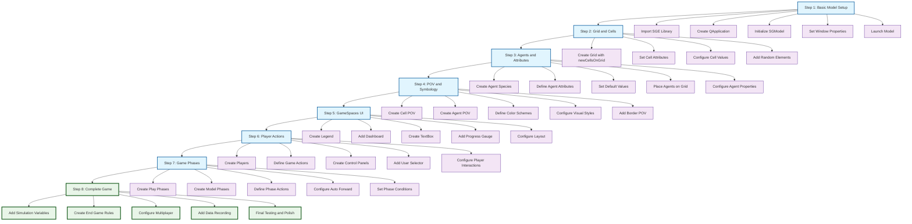

# SGE Model Construction Steps - Development Workflow

This diagram shows the incremental steps to build a complete SGE model, based on the A_to_Z_examples series and complete game examples.

## Overview

The SGE model construction follows a progressive approach from basic setup to complete interactive games, with each step building upon the previous ones.



## Detailed Construction Steps

### **Step 1: Basic Model Setup**
```python
# Import and setup
import sys
from pathlib import Path
sys.path.insert(0, str(Path(__file__).parent.parent.parent))
from mainClasses.SGSGE import *

# Application and model initialization
monApp = QtWidgets.QApplication([])
myModel = SGModel(550, 550, windowTitle="My Game")
myModel.launch()
sys.exit(monApp.exec_())
```

### **Step 2: Grid and Cells**
```python
# Create grid and configure cells
Cell = myModel.newCellsOnGrid(10, 10, "square", size=50)
Cell.setEntities("landUse", "grass")
Cell.setEntities_withColumn("landUse", "forest", 1)
Cell.setRandomEntities("landUse", "shrub", 10)
```

### **Step 3: Agents and Attributes**
```python
# Create agent species with attributes
Sheeps = myModel.newAgentSpecies("Sheeps", "triangleAgent2", defaultSize=25)
Sheeps.setDefaultValues_randomNumeric({"health": range(0, 100, 10), "hunger": range(0, 100, 10)})

# Place agents on grid
m1 = Sheeps.newAgentAtCoords(Cell, 1, 1, {"health": 70, "hunger": 20})
Sheeps.newAgentsAtRandom(10, Cell)
```

### **Step 4: POV and Symbology**
```python
# Create visual representations
Cell.newPov("base", "landUse", {"grass": Qt.green, "shrub": Qt.yellow, "forest": Qt.darkGreen})

# Agent POV with color gradients
health_colors = {100: Qt.blue, 90: QColor(32, 0, 223), 80: QColor(64, 0, 191), ...}
Sheeps.newPov("Health", "health", health_colors)
```

### **Step 5: GameSpaces UI**
```python
# Create UI components
Legend = myModel.newLegend(alwaysDisplayDefaultAgentSymbology=True)
Dashboard = myModel.newDashBoard("Scores", borderColor=Qt.black, textColor=Qt.black)
TextBox = myModel.newTextBox("Welcome to the game!", title="Instructions")
ProgressGauge = myModel.newProgressGauge(simVar, minimum=0, maximum=100, title="Progress")
```

### **Step 6: Player Actions**
```python
# Create players and their actions
Player1 = myModel.newPlayer("Player 1", {"Percentage of grass": 0})
Player1.addGameAction(myModel.newModifyAction(Cell, {"landUse": "grass"}, 3))

Player2 = myModel.newPlayer("Player 2", {"Sheeps in good health": 0})
Player2.addGameAction(myModel.newCreateAction(Sheeps, {"health": 100}, 4))

# Create control panels
Player1ControlPanel = Player1.newControlPanel("Actions du Joueur 1")
userSelector = myModel.newUserSelector()
```

### **Step 7: Game Phases**
```python
# Create game phases
playPhase = myModel.newPlayPhase("Player Turn", ["Player 1", "Player 2"], [])
modelPhase = myModel.newModelPhase(
    actions=[lambda: agent.moveAgent(method="random")],
    condition=lambda: myModel.roundNumber() > 5,
    name="Automatic Movement",
    auto_forward=True
)
```

### **Step 8: Complete Game**
```python
# Add simulation variables
score = myModel.newSimVariable("Player Score", 100)
dashboard.addIndicatorOnSimVariable(score)

# Create end game rules
endGameRule = myModel.newEndGameRule(title="EndGame Rules", numberRequired=1)
endGameRule.addCondition(SGEndGameCondition("Score > 100", "Player wins"))

# Configure data recording
myModel.newDataRecorder()
```

## Key Patterns and Best Practices

### **Progressive Development**
- Start with basic model setup
- Add complexity incrementally
- Test each step before proceeding
- Build upon previous components

### **Component Organization**
- **Core**: Model, Grid, Cells, Agents
- **Visual**: POV, Symbology, GameSpaces
- **Interaction**: Players, Actions, Phases
- **Advanced**: Variables, Rules, Recording

### **Code Structure**
- Import SGE library
- Initialize application and model
- Configure components step by step
- Launch model and start event loop

### **Testing Strategy**
- Run model after each major step
- Verify visual elements display correctly
- Test interactions and behaviors
- Validate game logic and rules

## Common Development Workflow

1. **Plan**: Define game concept and requirements
2. **Setup**: Create basic model structure
3. **Build**: Add components incrementally
4. **Test**: Verify functionality at each step
5. **Refine**: Adjust parameters and behaviors
6. **Polish**: Add UI elements and final touches
7. **Deploy**: Package and distribute game

This progressive approach ensures stable development and makes debugging easier by isolating issues to specific construction steps.

