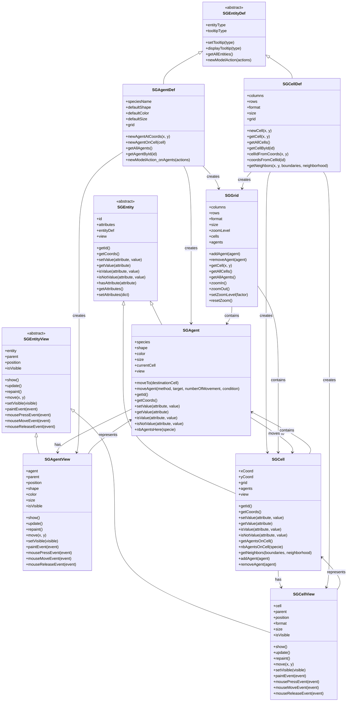

# SGE Model-View Architecture - Detailed Diagram

This diagram provides a comprehensive view of the Model-View architecture in SGE, showing how Models and Views interact, their lifecycle, and the separation of concerns.

## Overview

SGE implements a strict Model-View architecture where each entity has both a Model (data/logic) and a View (UI/display) component. This separation enables fluid agent movement, better code organization, and cleaner separation of concerns.



## Model-View Architecture Principles

### **Separation of Concerns**
- **Models** (`SGAgent`, `SGCell`): Contain game logic, data, and behavior
- **Views** (`SGAgentView`, `SGCellView`): Handle UI rendering and user interactions
- **No direct coupling**: Models don't know about Views, Views delegate to Models

### **1:1 Relationship**
- Each Model has exactly one corresponding View
- Each View represents exactly one Model
- Views are automatically created with Models via factory methods

### **Lifecycle Management**
- **Creation**: Factory methods create both Model and View simultaneously
- **Movement**: `moveTo()` updates both Model position and View positioning
- **Destruction**: Views are automatically managed by Qt's parent-child system

## Key Methods and Interactions

### **Model Methods (Game Logic)**
```python
# Agent model methods
agent.moveTo(targetCell)           # Changes model position
agent.setValue("health", "good")   # Updates model data
agent.moveAgent(method="random")   # Model behavior

# Cell model methods
cell.setValue("terrain", "forest") # Updates cell data
cell.addAgent(agent)               # Model state change
cell.getNeighbors()                # Model logic
```

### **View Methods (UI Management)**
```python
# View display methods
agent.view.show()                  # Makes view visible
agent.view.update()                # Schedules repaint
agent.view.move(x, y)              # Updates view position
agent.view.setVisible(True)        # Controls visibility
```

### **Critical show() Method**
The `show()` method is essential for proper UI display:
- **Purpose**: Makes the widget visible and ensures proper positioning
- **Usage**: Called after creating views or moving agents between grids
- **Interaction**: Works with `update()` to ensure visual updates

## Usage Patterns

### **1. Creating Model-View Pairs**
```python
# Use factory methods for consistent creation
agent = agentDef.newAgentAtCoords(x, y)  # Creates both model and view
cell = cellDef.newCell(x, y)            # Creates both model and view

# CRITICAL: Always call show() after creation
agent.view.show()
cell.view.show()
```

### **2. Moving Agents Between Grids**
```python
# When moving agents, ensure proper view parenting
agent.moveTo(newCell)
# The moveTo method handles:
# - Changing view parent to new grid
# - Calling show() for proper positioning
# - Processing Qt events for layout updates

# Additional show() call for safety
agent.view.show()
```

### **3. View Lifecycle Management**
```python
# Views are automatically managed by the Model-View system
# Developers should not manually create or destroy views
# Use the factory methods in SGEntityFactory

# Proper view updates
agent.view.update()    # Asynchronous repaint (preferred)
agent.view.repaint()   # Synchronous repaint (avoid unless necessary)
```

### **4. Event Handling**
```python
# Views handle user interactions and delegate to models
def mousePressEvent(self, event):
    # View handles UI event
    if event.button() == Qt.LeftButton:
        # Delegate to model
        self.entity.doSomething()
```

## Architecture Benefits

### **Fluid Agent Movement**
- Agents can move between grids without losing state
- Views are properly repositioned and reparented
- No visual glitches during movement

### **Better Code Organization**
- Clear separation between game logic and UI
- Models focus on simulation behavior
- Views focus on user interaction and display

### **Cleaner Separation of Concerns**
- Game logic is independent of UI framework
- Views can be modified without affecting game logic
- Models can be tested without UI dependencies

### **Qt Integration**
- Views are proper Qt widgets
- Automatic event handling and layout management
- Integration with Qt's parent-child system

## Common Pitfalls and Solutions

### **❌ Creating Models Directly**
```python
# WRONG - Missing View creation
agent = SGAgent(x, y)
```

### **✅ Using Factory Methods**
```python
# CORRECT - Creates both Model and View
agent = agentDef.newAgentAtCoords(x, y)
agent.view.show()
```

### **❌ Forgetting show() After Movement**
```python
# WRONG - Agent might be invisible
agent.moveTo(newCell)
```

### **✅ Always Call show()**
```python
# CORRECT - Ensures visibility
agent.moveTo(newCell)
agent.view.show()
```

### **❌ Direct View Manipulation**
```python
# WRONG - Bypassing Model-View architecture
agent.view.move(100, 100)
```

### **✅ Using Model Methods**
```python
# CORRECT - Proper Model-View coordination
agent.moveTo(targetCell)
```

