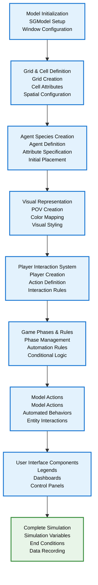

# SGE Model Construction Workflow - Academic Version V2 (Vertical Layout)

This diagram presents the core workflow for building SGE models with the same content as V1 but using a vertical arrangement for better space utilization.

## Overview

The SGE framework follows a systematic approach to model construction, progressing from basic structural elements to interactive simulation components.



## Core Components and Workflow

### **Phase 1: Structural Foundation**
- **Model Initialization**: Create SGModel instance with window properties
- **Grid & Cell Definition**: Establish spatial structure with cell attributes

### **Phase 2: Agent-Based Elements**
- **Agent Species Creation**: Define agent types with behavioral attributes
- **Visual Representation**: Configure POV (Point of View) for visual mapping

### **Phase 3: Simulation Logic**
- **Player Interaction System**: Create players with game actions and control panels
- **Game Phases & Rules**: Implement play phases and automated model phases

### **Phase 4: Automated Behaviors**
- **Model Actions**: Define automated behaviors for entities and system interactions

### **Phase 5: Interface and Completion**
- **User Interface Components**: Add legends, dashboards, and control elements
- **Complete Simulation**: Add simulation variables, end conditions, and data recording

## Key Framework Characteristics

### **Progressive Development**
The SGE framework supports incremental model construction, allowing developers to build complexity gradually while maintaining system stability.

### **Separation of Concerns**
- **Structural**: Grid and cell management
- **Behavioral**: Agent definition and interaction
- **Visual**: POV and symbology systems
- **Interactive**: Player actions and game phases

### **Model-View Architecture**
Each entity maintains a clear separation between data/logic (Model) and presentation (View), enabling flexible visualization and interaction.

## Implementation Pattern

```python
# 1. Model Setup
model = SGModel(width, height, windowTitle="Simulation")

# 2. Grid Definition
cells = model.newCellsOnGrid(rows, cols, format, size)
cells.setEntities(attribute, value)

# 3. Agent Creation
agents = model.newAgentSpecies(name, shape, properties)
agents.newAgentAtCoords(cells, x, y, attributes)

# 4. Visual Configuration
cells.newPov(name, attribute, colorMapping)
agents.newPov(name, attribute, colorMapping)

# 5. Player System
player = model.newPlayer(name)
player.addGameAction(action)

# 6. Phase Management
playPhase = model.newPlayPhase(name, players, actions)
modelPhase = model.newModelPhase(actions, conditions)

# 7. Model Actions
modelAction = model.newModelAction(actions=[lambda: doSomething()])
cellAction = model.newModelAction_onCells(actions=[lambda cell: cell.doSomething()])

# 8. Interface Components
legend = model.newLegend()
dashboard = model.newDashBoard(title)

# 9. Launch
model.launch()
```

This workflow demonstrates SGE's systematic approach to agent-based simulation development, providing a clear methodology for researchers and practitioners in computational modeling.

