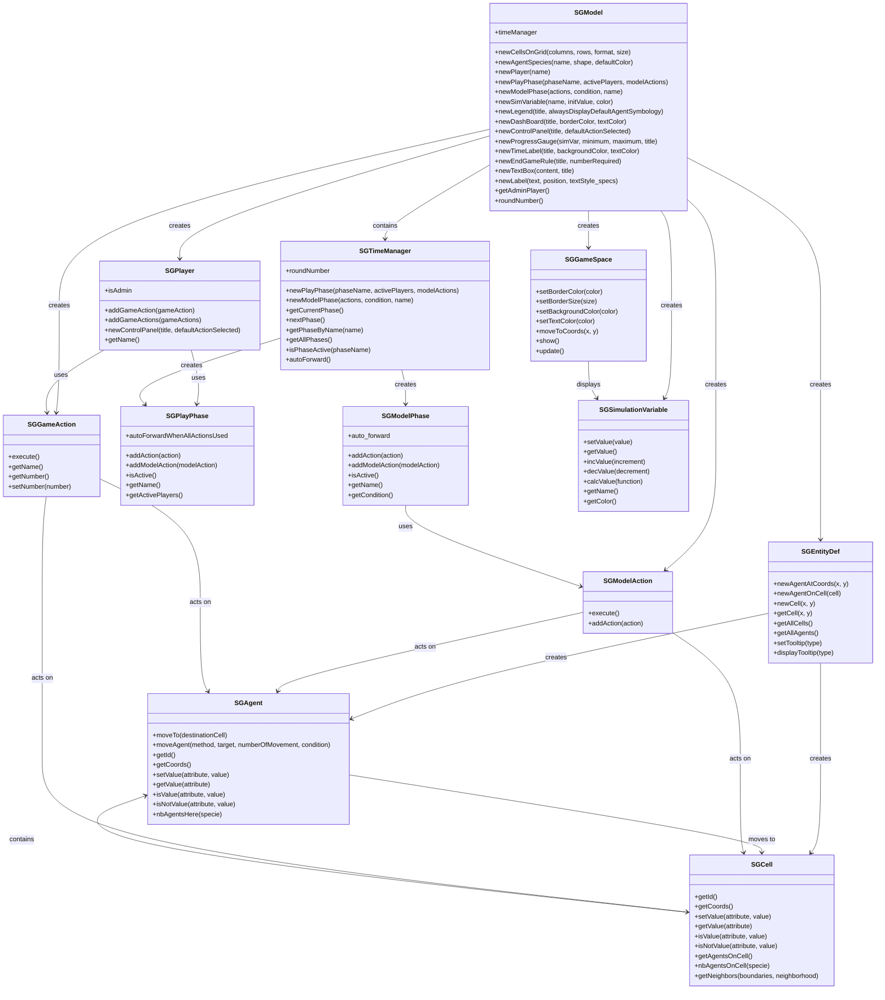

# SGE Classes Diagram for Modelers

This diagram shows the main classes that modelers interact with when creating SGE games and simulations.

## Overview

Modelers primarily work with these core classes to build their games:



## Key Classes for Modelers

### Core Model Classes
- **SGModel**: Main entry point for creating games
- **SGEntityDef**: Factory for creating agents and cells
- **SGAgent**: Individual agents in the simulation
- **SGCell**: Grid cells containing agents and data

### Player and Interaction Classes
- **SGPlayer**: Represents a player in the game
- **SGGameAction**: Actions players can perform (acts on agents and cells)
- **SGPlayPhase**: Interactive game phases with player actions
- **SGModelPhase**: Automated game phases with model actions
- **SGTimeManager**: Manages game phases and timing

### Data and Display Classes
- **SGSimulationVariable**: Variables for scores, counters, etc.
- **SGGameSpace**: UI components (legends, dashboards, etc.)
- **SGModelAction**: Automated actions for model phases

## Usage Patterns

### 1. Basic Setup
```python
model = SGModel()
cellDef = model.newCellsOnGrid(10, 10, "square", 30)
agentDef = model.newAgentSpecies("Sheeps", "circleAgent", Qt.gray)
```

### 2. Creating Entities
```python
agent = agentDef.newAgentAtCoords(5, 5)
cell = cellDef.getCell(5, 5)
agent.moveTo(cell)
```

### 3. Player Actions
```python
player = model.newPlayer("Player 1")
action = model.newCreateAction(agentDef, {"health": "good"}, 5)
player.addGameAction(action)
```

### 4. Game Phases
```python
playPhase = model.newPlayPhase("Player Turn", ["Player 1"], [])
modelPhase = model.newModelPhase([lambda: agent.moveAgent()], lambda: model.roundNumber() > 5)

# Access timeManager directly
timeManager = model.timeManager
currentPhase = timeManager.getCurrentPhase()
roundNumber = timeManager.roundNumber
```
