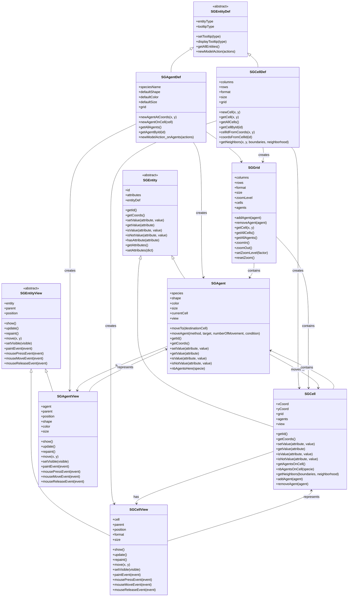

# SGE Entities and EntityDef - Detailed Classes Diagram

This diagram provides a detailed view of the Entities system in SGE, showing the Model-View architecture and the relationship between EntityDefs and their instances.

## Overview

Entities in SGE follow a Model-View architecture where each entity has both a Model (data/logic) and a View (UI/display) component. EntityDefs serve as factories for creating entity instances.



## Entity Architecture

### Model-View Separation
- **Models** (`SGAgent`, `SGCell`): Contain game logic, data, and behavior
- **Views** (`SGAgentView`, `SGCellView`): Handle UI rendering and user interactions
- **EntityDefs** (`SGAgentDef`, `SGCellDef`): Factory classes for creating Model-View pairs

### Entity Types
- **SGAgent**: Individual agents that can move between cells
- **SGCell**: Grid cells that contain agents and have properties
- **SGGrid**: Container for cells and agents with zoom functionality

## Usage Patterns

### 1. Creating Entity Definitions
```python
# Create cell definition with grid
cellDef = model.newCellsOnGrid(columns=10, rows=10, format="square", size=30)

# Create agent definition (species)
agentDef = model.newAgentSpecies("Sheeps", "circleAgent", defaultColor=Qt.gray)
```

### 2. Creating Entity Instances
```python
# Create agent at specific coordinates
agent = agentDef.newAgentAtCoords(x=5, y=5)

# Create agent on specific cell
cell = cellDef.getCell(x=5, y=5)
agent2 = agentDef.newAgentOnCell(cell)

# Create cell
newCell = cellDef.newCell(x=6, y=6)
```

### 3. Entity Movement
```python
# Move agent to different cell
agent.moveTo(targetCell)

# Move agent with patterns
agent.moveAgent(method="random")
agent.moveAgent(target="up")
agent.moveAgent(target=(3, 4))
agent.moveAgent(target=15)  # cell ID
```

### 4. Entity Properties
```python
# Set and get entity attributes
agent.setValue("health", "good")
cell.setValue("terrain", "forest")

# Check entity properties
if agent.isValue("health", "good"):
    print("Agent is healthy")

if cell.isNotValue("terrain", "water"):
    print("Cell is not water")
```

### 5. Entity Queries
```python
# Get entity information
agentId = agent.getId()
coords = agent.getCoords()
cellId = cell.getId()

# Count entities
agentCount = cell.nbAgentsOnCell()
sheepCount = cell.nbAgentsOnCell("Sheeps")

# Get neighbors
neighbors = cell.getNeighbors(boundaries="open", neighborhood="moore")
```

## Key Characteristics

### Model-View Architecture
- Each entity has both Model and View components
- Models handle game logic, Views handle UI
- Views delegate user interactions back to Models
- Automatic synchronization between Model and View

### Factory Pattern
- EntityDefs serve as factories for creating entities
- Consistent creation of Model-View pairs
- Centralized entity management

### Grid System
- 1-based coordinate system (starts at (1,1))
- Support for square and hexagonal grids
- Zoom functionality with independent levels per grid
- Neighborhood calculations for different geometries

### Entity Lifecycle
- Creation through EntityDef factory methods
- Movement between cells with proper view updates
- Automatic view management (show(), update(), repaint())
- Qt event handling for user interactions

