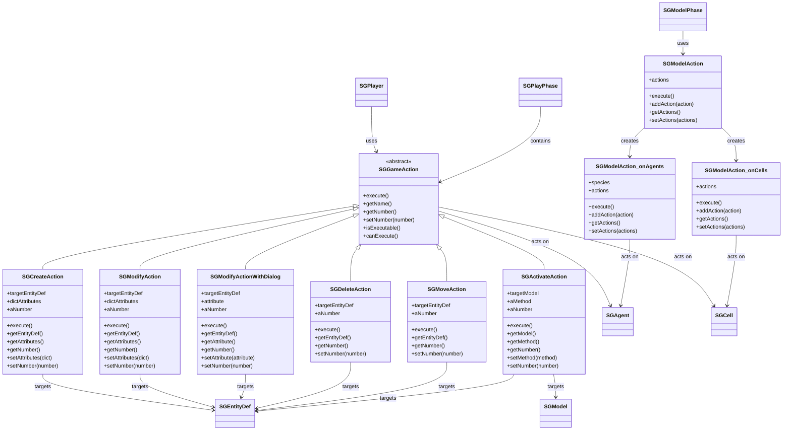

# SGE GameActions - Detailed Classes Diagram

This diagram provides a detailed view of the GameActions system in SGE, showing all types of actions that players and the model can perform.

## Overview

GameActions are the core mechanism for interaction in SGE games. They allow players to modify the simulation state and enable automated model behaviors.



## GameAction Types

### Player Actions (SGGameAction subclasses)
- **SGCreateAction**: Create new agents or cells with specified attributes
- **SGModifyAction**: Modify existing entities with predefined values
- **SGModifyActionWithDialog**: Modify entities with user input dialog
- **SGDeleteAction**: Remove agents from the simulation
- **SGMoveAction**: Move agents to different cells
- **SGActivateAction**: Execute model methods (like nextTurn)

### Model Actions (SGModelAction subclasses)
- **SGModelAction**: General model actions
- **SGModelAction_onCells**: Actions applied to all cells
- **SGModelAction_onAgents**: Actions applied to specific agent species

## Usage Patterns

### 1. Creating Player Actions
```python
# Create action - adds 5 sheep agents
createAction = model.newCreateAction(
    agentDef, 
    dictAttributes={"health": "good"}, 
    aNumber=5
)

# Modify action - changes cell terrain
modifyAction = model.newModifyAction(
    cellDef, 
    dictAttributes={"terrain": "forest"}, 
    aNumber='infinite'
)

# Delete action - removes 3 agents
deleteAction = model.newDeleteAction(agentDef, aNumber=3)

# Move action - moves 10 agents randomly
moveAction = model.newMoveAction(agentDef, aNumber=10)

# Activate action - triggers next turn (on model)
activateAction = model.newActivateAction(model, aMethod="nextTurn", aNumber='infinite')

# Activate action - triggers method on specific entity type
activateSheepAction = model.newActivateAction(agentDef, aMethod="reproduce", aNumber=5)
```

### 2. Creating Model Actions
```python
# General model action
modelAction = model.newModelAction(actions=[lambda: doSomething()])

# Action on all cells
cellAction = model.newModelAction_onCells(actions=[lambda cell: cell.setValue("type", "forest")])

# Action on specific agent species
sheepAction = model.newModelAction_onAgents("Sheeps", actions=[lambda agent: agent.moveAgent()])
```

### 3. Using Actions in Phases
```python
# Add player actions to play phase
playPhase = model.newPlayPhase("Player Turn", ["Player 1"], [])
playPhase.addAction(createAction)

# Add model actions to model phase
modelPhase = model.newModelPhase([modelAction], lambda: model.roundNumber() > 5)
```

## Key Characteristics

### Action Hierarchy
- All player actions inherit from `SGGameAction`
- Model actions are separate but follow similar patterns
- Actions can target specific entity definitions or the entire model

### Execution Context
- **Player Actions**: Executed during `SGPlayPhase` by active players
- **Model Actions**: Executed during `SGModelPhase` automatically
- **Targeted Actions**: Can act on specific entity types or species

### Number Parameter
- Controls how many times an action can be executed
- `'infinite'` allows unlimited executions
- Numeric values limit executions per phase
